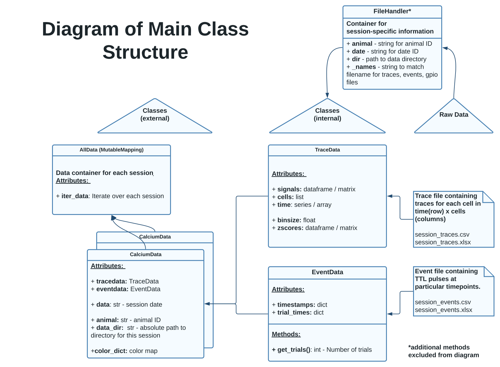

<h1> Calcium Imaging Data Analysis </h1>

<p>
  
</p>

*Images from poster presented at AChems 2022 [[1]](#1).

###### **This project takes `.csv` files gathered from Inscopix Data Processing software for processing:**

* Syncing traces with externally captured GPIO events.</li>
* General  based statistics.</li>
* Plotting: animated, 2D and 3D scatter, regression, skree, heatmap and correlation matrix.</li>
* Dimensionality reduction with variance filters and principal component analysis.</li>
* Support Vector Machine Learning for classification tasks.</li>


[](https://github.com/NeuroPyPy/CalciumAnalysis/blob/master/LICENSE)

[](https://www.codefactor.io/repository/github/neuropypy/calciumanalysis)


<table>
  <tr >
    <td nowrap><strong>Supported OS</strong></td>
    <td>Linux (list of <a href="./docs/POSIX.md#the-list-of-posix-api-used-in-areg-sdk-including-multicast-message-router" alt="list of POSX API">POSIX API</a>), Windows 7 and higher.</td>
   </tr>
</table>

---
### Directory Structure
For data loading, directories should be formatted a particular way that can be easily 
modified by configuring `data.data_utils.file_handler`.
```bash
./data/
├── Animal 1
│   ├── Day 1
│   │   ├── *Events.csv
│   │   └── *Traces.csv
│   └── Day 2
│       ├── *Events.csv
│       └── *Traces.csv
├── Animal 2
│   └── Day 1
│       ├── *Events.csv
│       └── *Traces.csv
└── Animal 3
    └── Day 1
        ├── *Events.csv
        └── *Traces.csv

```
---
### Parameters and Directories
A configuration file `config.yaml` contains defaults that can be set in a single top-level file.

1. `DIRS:` - directories for loading and saving data
   ```yaml
   DIRS:
     data_dir: '/Users/me/mydata'   # os is internally handled
     save_stats: '~./home'          # save statistical output
     save_figs: '~/graphs'          # can have multiple sub-dirs 
     save_nn:  '~/svm'              # train/test/eval scores from neural network 
   ```
3. `SESSION:` - session instance information
   ```yaml
   SESSION:
     animal: 'animal_ID' # must include char + num
     date: '123456'      # must include all nun
     dir: '/my/data'     # must include / or \ 
   
   ```

3. `COLORS:` - event : color pairing
   ```yaml
   COLORS:
     Event1: 'color'
     Event2: 'color'
     Event3: 'color'
   # from matplotlib.colors API
   ```
   
4. `DECODER:` - Decode GPIO signals into events
   ```yaml
   DECODER:
     Event1: 1, 2, 3, 4
     Event2: 1, 3, 4
     Event3: 1, 2, 3
     Event4: 1, 4
   # see data/data_utils/gpio_data.py for implementation
   ```
   
---



---

### **TO DO:**
* Additional layers to neural network for additional feature extraction
  * Layer for additional outlier/anomaly detection
  * Layer for linear trend normalization
  * Any additional feature extraction layers i.e. temporal coding [[2]](#2), latency, duration, etc.
* Incorperate dataflow-based modeling design i.e. mapping actors to threads and the vectorization of actors (see [[3]](#3))
* Format all docstrings to NumPy style


#### References
<a id="1">[1]</a> 
Long Term In-Vivo One-Photon Ca2+ Imaging of Taste-Responsive Cells In The Parabrachial Pons In The Freely Licking Rat.
Flynn P. O'Connell1, Joshua D. Sammons2, Patricia M. Di Lorenzo1. 1Binghamton University, Binghamton, NY, USA. 2University of Alabama at Birmingham, Birmingham, AL, USA. [Achems.org](https://achems.org/web/)

<a id="2">[2]</a> 
Hallock R. M., Di Lorenzo P. M. (2006). Temporal coding in the gustatory system. Neurosci. Biobehav. Rev. 30, 1145–1160. [10.1016/j.neubiorev.2006.07.005](https://www.sciencedirect.com/science/article/abs/pii/S0149763406000741)

<a id="3">[3]</a> 
Kyunghun Lee, Xiaomin Wu, Yaesop Lee, Da-Ting Lin, Shuvra S. Bhattacharyya & Rong Chen (2021) Neural decoding on imbalanced calcium imaging data with a network of support vector machines, Advanced Robotics, 35:7, 459-470, [DOI: 10.1080/01691864.2020.1863259](https://www.tandfonline.com/doi/abs/10.1080/01691864.2020.1863259?journalCode=tadr20) 
